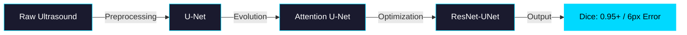

<div align="center">

<!-- Animated Medical AI Banner -->


<!-- Typing SVG Effect -->
<a href="https://git.io/typing-svg"></a>

<!-- Tech Stack Badges with Medical Theme -->
<p align="center">
  
  
  
  
  
</p>

<!-- Status Badges -->
<p align="center">
  
  
  
</p>

</div>

---

## 🎯 **What I Do**

<div align="center">

```ascii
╔════════════════════════════════════════════════════════════════╗
║  Building Production-Grade Medical Computer Vision Systems    ║
║                                                                ║
║  🏥 Medical Image Segmentation & Landmark Detection            ║
║  🧠 Deep Learning Architecture Design & Optimization           ║
║  🚀 Deployment-Ready Inference Pipelines                       ║
║  📊 Clinical Metrics > Theoretical Claims                      ║
╚════════════════════════════════════════════════════════════════╝
```

</div>

<table align="center">
<tr>
<td width="33%" align="center">

<br><b>Deep Learning</b>
<br><sub>Signal > Buzzwords</sub>
</td>
<td width="33%" align="center">

<br><b>Production Ready</b>
<br><sub>Metrics > Claims</sub>
</td>
<td width="33%" align="center">

<br><b>Computer Vision</b>
<br><sub>Inference > Notebooks</sub>
</td>
</tr>
</table>

---

## 🧠 **Core Expertise**

<div align="center">


</div>

<table>
<tr>
<td width="50%" valign="top">

### 🏥 **Medical Computer Vision**
```python
expertise = {
    "Segmentation": ["U-Net", "Attention U-Net", "ResNet-UNet"],
    "Detection": ["Landmark Detection", "Object Localization"],
    "Metrics": ["Dice Score 0.95+", "6px Median Error"],
    "Data": ["Noisy Ultrasound", "Low Contrast", "Real Clinical"]
}
```

### 🤖 **Deep Learning & ML**
```python
stack = {
    "Frameworks": ["PyTorch", "Scikit-Learn"],
    "Techniques": ["Transfer Learning", "Mixed Precision (AMP)"],
    "Classical_ML": ["XGBoost", "Feature Engineering"]
}
```

</td>
<td width="50%" valign="top">

### 🔬 **Applied GenAI (Selective)**
```python
tools = {
    "RAG_Systems": ["FAISS", "ChromaDB"],
    "Frameworks": ["LangChain"],
    "Focus": "Production-Relevant Only"
}
```

### 🚀 **Deployment & Engineering**
```python
deployment = {
    "Containerization": "Docker",
    "Pipeline": "Reproducible Training",
    "Monitoring": "MLOps Mindset",
    "Inference": "Optimized & Ready"
}
```

</td>
</tr>
</table>

---

## 📌 **Featured Repositories**

<div align="center">

### 🎯 **Primary Interview Projects**

</div>

<!-- Fetal Ultrasound Project Card -->
<div align="center">
<a href="https://github.com/bishwajitSingh123/fetal-ultrasound-biometry">

</a>
</div>

<table align="center">
<tr>
<td align="center" width="33%">

<br><sub><b>Clinical Accuracy</b></sub>
</td>
<td align="center" width="33%">

<br><sub><b>Precision Detection</b></sub>
</td>
<td align="center" width="33%">

<br><sub><b>Advanced Design</b></sub>
</td>
</tr>
</table>

<details>
<summary><b>🔬 Technical Deep Dive</b></summary>

<br>

**🏥 Fetal Ultrasound Biometry — Medical AI**

<div align="center">



</div>

**Key Innovations:**
- ✅ **Architecture Evolution**: Systematic progression from baseline to SOTA
- ✅ **Real Clinical Constraints**: Designed for noise, blur, low contrast
- ✅ **Deployment Ready**: Dockerized inference with monitoring
- ✅ **Reproducible Pipelines**: Full training & evaluation scripts

**Impact**: Clinical-grade accuracy on real-world ultrasound data

</details>

---

<div align="center">

### 🤖 **AI Systems & Applied ML**

<table>
<tr>
<td width="50%">

<a href="https://github.com/bishwajitSingh123/ai-resume-matcher">

</a>

**🤖 AI Resume Matcher**
<br>
<sub>RAG System | FAISS | Semantic Search</sub>


</td>
<td width="50%">

<a href="https://github.com/bishwajitSingh123/taxi-trip-prediction">

</a>

**🚖 Taxi Trip Prediction**
<br>
<sub>Kaggle Top-15 | Feature Engineering</sub>


</td>
</tr>
</table>

</div>

---

## 🏆 **Proof of Work**

<div align="center">


</div>

<table align="center">
<tr>
<td align="center">

<br><sub>Landmark Detection</sub>
</td>
<td align="center">

<br><sub>Competition Performance</sub>
</td>
<td align="center">

<br><sub>Research Rigor</sub>
</td>
<td align="center">

<br><sub>Noisy Ultrasound</sub>
</td>
</tr>
</table>

---

## 🛠 **Tech Stack**

<div align="center">


<br><br>

<table>
<tr>
<td align="center" width="20%">

<br><b>Python</b>
</td>
<td align="center" width="20%">

<br><b>PyTorch</b>
</td>
<td align="center" width="20%">

<br><b>OpenCV</b>
</td>
<td align="center" width="20%">

<br><b>Docker</b>
</td>
<td align="center" width="20%">

<br><b>Scikit-Learn</b>
</td>
</tr>
</table>

**Languages**: Python | SQL  
**Frameworks**: PyTorch | Scikit-Learn | LangChain  
**Vision**: OpenCV | NumPy | Matplotlib  
**GenAI**: FAISS | ChromaDB  
**Deployment**: Docker | Git | Linux

</div>

---

## 🎓 **Background**

<div align="center">

```yaml
Education:
  Degree: "B.Tech in Computer Science Engineering"
  Institution: "NSHM Knowledge Campus, Durgapur"
  Duration: "2019 - 2023"
  CGPA: "8.71/10"
  
Philosophy:
  Code: "Strong models are built with discipline, not noise"
  Focus: ["Clinical Relevance", "Production Readiness", "Measurable Impact"]
```

</div>

---

## 📬 **Let's Connect**

<div align="center">


<br><br>

**🎯 Actively seeking roles where medical imaging models move toward real-world use**

<br>

<a href="mailto:bishwajit.1804@gmail.com">

</a>
<a href="https://linkedin.com/in/bishwajit-singh">

</a>
<a href="https://kaggle.com/bishwajitsingh">

</a>
<a href="https://github.com/bishwajitSingh123">

</a>

<br><br>

### 💭 **Philosophy**


</div>

---

<div align="center">

<!-- Footer Wave -->


<sub>⚡ This README updates automatically via GitHub Actions</sub>

</div>
